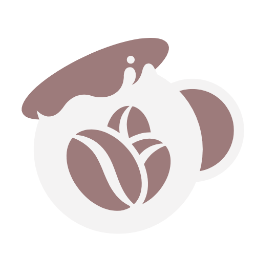
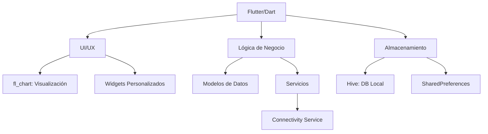
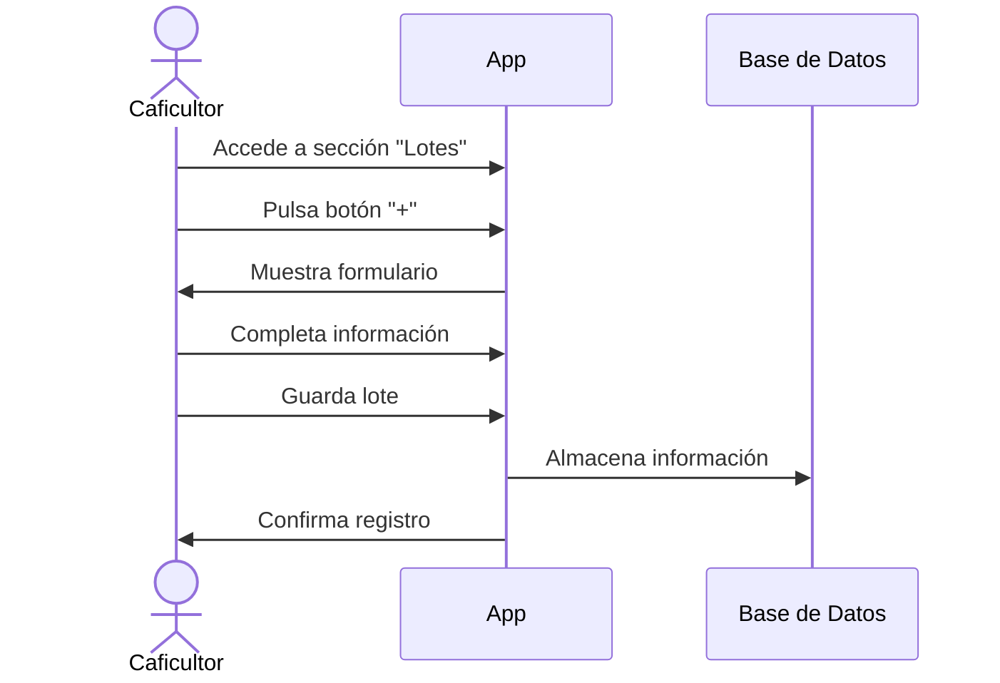
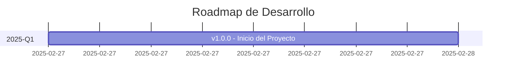

<div align="center">

# 🌱 Inventario Cafetero



### Gestión inteligente para pequeños productores de café

[](https://flutter.dev/)
[](https://dart.dev/)
[](https://pub.dev/packages/hive)
[](LICENSE)
[](https://github.com/DavidCreat/cafeteros_app)

**Autor:** DAVID ALEXANDER FONSECA PEREZ  
**Proyecto académico - Universidad**

[Ver Demo](#) • [Reportar Bug](https://github.com/DavidCreat/cafeteros_app/issues) • [Solicitar Función](https://github.com/DavidCreat/cafeteros_app/issues)

</div>

---

## 📋 Índice

- [🌟 Descripción del Proyecto](#-descripción-del-proyecto)
- [🚀 Características Principales](#-características-principales)
- [🔧 Arquitectura y Tecnologías](#-arquitectura-y-tecnologías)
- [📱 Instalación y Configuración](#-instalación-y-configuración)
- [📂 Estructura del Proyecto](#-estructura-del-proyecto)
- [📊 Capturas de Pantalla](#-capturas-de-pantalla)
- [📖 Guía de Uso](#-guía-de-uso)
- [🌟 Innovación y Visión](#-innovación-y-visión)
- [📅 Estado Actual y Roadmap](#-estado-actual-y-roadmap)
- [🧪 Testing](#-testing)
- [🔄 CI/CD](#-cicd)
- [👥 Contribución](#-contribución)
- [📄 Licencia](#-licencia)
- [🤝 Agradecimientos](#-agradecimientos)
- [📞 Contacto](#-contacto)

---

## 🌟 Descripción del Proyecto

Inventario Cafetero es una aplicación móvil y web diseñada para revolucionar la gestión del café en Norte de Santander, Colombia. Pensada para caficultores, cooperativas y asociaciones, esta app ofrece una experiencia visual, intuitiva y lista para funcionar incluso en entornos rurales con conectividad limitada.

### Problemática que resuelve

La aplicación aborda desafíos específicos del sector cafetero colombiano:

| Problema | Solución |
|----------|----------|
| **Gestión manual y propensa a errores** | Digitalización intuitiva con validación de datos |
| **Dificultad para visualizar datos** | Dashboard interactivo con gráficas animadas |
| **Conectividad intermitente** | Funcionalidad offline prioritaria con sincronización inteligente |
| **Barrera tecnológica** | Interfaz amigable en español con terminología cafetera local |
| **Falta de trazabilidad** | Seguimiento completo del ciclo de vida del café |

### Impacto social y económico

Inventario Cafetero busca empoderar a los pequeños productores mediante la tecnología, permitiéndoles:

- Reducir pérdidas por errores administrativos
- Tomar decisiones basadas en datos
- Mejorar la planificación de producción
- Facilitar el acceso a mercados especializados mediante trazabilidad

---

## 🚀 Características Principales

### Dashboard Visual e Interactivo

- **Tarjetas de resumen**: Visualización rápida de inventario, lotes y ventas
- **Gráficas animadas**: Diagramas de torta y barras para análisis de producción
- **Indicador de conexión**: Muestra el estado de conectividad (ideal para zonas rurales)
- **Experiencia personalizada**: Saludo con nombre del usuario y diseño inspirado en el café colombiano

### Gestión de Inventario y Lotes

- **Consulta eficiente**: Visualización rápida de existencias y movimientos
- **Registro simplificado**: Adición de nuevos lotes con interfaz intuitiva
- **Trazabilidad**: Seguimiento del ciclo de vida del café desde la cosecha
- **Categorización inteligente**: Organización por variedades, estados y fechas

### Preparada para Integración Futura

- **Arquitectura modular**: Diseñada para conectar con bases de datos y sincronización en la nube
- **Almacenamiento local**: Utiliza Hive para persistencia de datos sin conexión
- **Sincronización**: Preparada para implementar sincronización cuando hay conectividad
- **API Ready**: Estructura preparada para integración con servicios externos

### Pensada para el Usuario Real

- **Interfaz en español**: Terminología adaptada al contexto cafetero colombiano
- **Diseño accesible**: Pensada para usuarios con poca experiencia tecnológica
- **Funcionalidad offline**: Prioriza operaciones sin necesidad de conexión constante
- **Rendimiento optimizado**: Funciona en dispositivos de gama baja comunes en zonas rurales

---

## 🔧 Arquitectura y Tecnologías

### Stack Tecnológico



- **Framework**: Flutter (Dart) - Versión ^3.7.2
- **Almacenamiento local**: 
  - Hive ^2.2.3 - Base de datos NoSQL orientada a objetos
  - SharedPreferences ^2.2.2 - Almacenamiento de preferencias
- **Visualización de datos**: fl_chart ^0.64.0 - Gráficos interactivos
- **Gestión de conectividad**: connectivity_plus ^6.1.4 - Monitoreo de conexión
- **Generación de código**: build_runner ^2.4.15, hive_generator ^2.0.1

### Patrones de Diseño Implementados

- **Repository Pattern**: Abstracción de la fuente de datos para facilitar cambios futuros
- **Service Locator**: Gestión de dependencias para servicios como conectividad
- **Responsive Design**: Adaptación a diferentes tamaños de pantalla (móvil y tablet)
- **Offline-First**: Priorización de funcionalidad sin conexión con sincronización posterior
- **MVVM Simplificado**: Separación de lógica de presentación y datos

### Arquitectura de la Aplicación

```
lib/
├── app.dart                # Configuración de la aplicación y temas
├── main.dart               # Punto de entrada
├── repositories/           # Capa de datos y modelos
│   └── data_repository.dart # Gestión de datos con Hive
├── screens/                # Pantallas de la aplicación
│   ├── dashboard_screen.dart
│   ├── inventory_screen.dart
│   ├── lots_screen.dart
│   └── profile_screen.dart
├── services/               # Servicios (conectividad, etc.)
│   └── connectivity_service.dart
├── utils/                  # Utilidades y helpers
│   └── responsive_utils.dart
└── widgets/                # Componentes reutilizables
    ├── adaptive_card.dart
    ├── adaptive_layout.dart
    └── glass_bottom_nav.dart
```

---

## 📱 Instalación y Configuración

### Requisitos Previos

- Flutter SDK (versión ^3.7.2)
- Dart SDK (^3.0.0)
- Android Studio / VS Code
- Git

### Instalación para Desarrollo

1. Clona el repositorio:
   ```bash
   git clone https://github.com/DavidCreat/cafeteros_app.git
   cd inventario_cafetero
   ```

2. Instala las dependencias:
   ```bash
   flutter pub get
   ```

3. Genera los archivos necesarios:
   ```bash
   flutter pub run build_runner build --delete-conflicting-outputs
   ```

4. Ejecuta la aplicación en modo desarrollo:
   ```bash
   flutter run
   ```

### Instalación para Usuarios (Android)

1. Descarga el archivo APK desde la [sección de releases](https://github.com/DavidCreat/cafeteros_app/releases).
2. Habilita la instalación desde fuentes desconocidas en tu dispositivo Android.
3. Instala el archivo `app-release.apk`.
4. Abre la aplicación "Inventario Cafetero".

Alternativamente, genera el APK con:
```bash
flutter build apk --release
```

### Configuración de Iconos

Para actualizar los iconos de la aplicación:

```bash
flutter pub run flutter_launcher_icons
```

---

## 📂 Estructura del Proyecto

```
inventario_cafetero/
├── android/                # Configuración específica de Android
├── assets/                 # Recursos estáticos (iconos, imágenes)
│   └── icon/
│       ├── coffee_icon.png
│       └── coffee_icon.svg
├── ios/                    # Configuración específica de iOS
├── lib/                    # Código fuente principal
│   ├── repositories/       # Gestión de datos
│   ├── screens/            # Pantallas de la aplicación
│   ├── services/           # Servicios de la aplicación
│   ├── utils/              # Utilidades y helpers
│   ├── widgets/            # Componentes reutilizables
│   ├── app.dart            # Configuración de la aplicación
│   └── main.dart           # Punto de entrada
├── test/                   # Pruebas automatizadas
├── web/                    # Configuración específica para web
├── pubspec.yaml            # Dependencias y configuración
└── README.md               # Documentación
```

---

## 📖 Guía de Uso

### Navegación Principal

La aplicación cuenta con una navegación intuitiva mediante una barra inferior con las siguientes secciones:

- **Dashboard**: Resumen visual de la información más relevante
- **Inventario**: Gestión de existencias de café
- **Lotes**: Administración de lotes de producción
- **Perfil**: Configuración de usuario y preferencias

### Flujos Principales

#### 1. Registro de nuevo lote



1. Accede a la sección "Lotes"
2. Pulsa el botón "+" para añadir un nuevo lote
3. Completa la información requerida (variedad, cantidad, fecha, etc.)
4. Guarda el lote

#### 2. Consulta de inventario

1. Accede a la sección "Inventario"
2. Visualiza el inventario actual por variedad
3. Utiliza los filtros para refinar la búsqueda

#### 3. Análisis en Dashboard

1. Observa las gráficas de distribución de variedades
2. Consulta las tarjetas de resumen para datos clave
3. Verifica el indicador de conectividad

---

## 🌟 Innovación y Visión

### Enfoque Diferenciador

- **Contextualización local**: Colores, iconografía y flujos adaptados a la cultura cafetera colombiana
- **Visualización de datos**: Facilita la toma de decisiones mediante representaciones gráficas
- **Diseño centrado en el usuario**: Creado con y para caficultores reales
- **Tecnología accesible**: Democratización de herramientas digitales para el sector rural

### Visión a Futuro (2025-2030)

- **Trazabilidad completa**: Seguimiento desde la semilla hasta la taza con certificación blockchain
- **Integración IoT**: Conexión con sensores de humedad, temperatura y otros parámetros
- **Marketplace integrado**: Conexión directa entre productores y compradores internacionales
- **Analítica avanzada**: Predicciones de cosecha y recomendaciones personalizadas con IA
- **Comunidad cafetera digital**: Red social especializada para compartir conocimientos

---

## 📅 Estado Actual y Roadmap

### Estado Actual (v1.0.0)

- MVP funcional con dashboard visual, gestión de inventario y navegación básica
- Almacenamiento local implementado con Hive
- Interfaz de usuario completa y responsive
- Listo para pruebas con usuarios y retroalimentación

---

### Estado Actual (Febrero 2025)



#### Estado Actual (v1.0.0 - 27 de Febrero 2025)
- MVP funcional con dashboard visual y gestión de inventario
- Almacenamiento local implementado con Hive
- Interfaz de usuario completa y responsive

---

## 🧪 Testing

### Estrategia de Pruebas

- **Pruebas unitarias**: Validación de lógica de negocio y modelos de datos
- **Pruebas de widgets**: Verificación de componentes de UI
- **Pruebas de integración**: Validación de flujos completos
- **Pruebas de usuario**: Sesiones con caficultores reales

### Ejecución de Pruebas

```bash
# Ejecutar todas las pruebas
flutter test

# Ejecutar pruebas con cobertura
flutter test --coverage
```

---

## 🔄 CI/CD

### Pipeline de Integración Continua

El proyecto utiliza GitHub Actions para automatizar:

- Verificación de código (linting)
- Ejecución de pruebas
- Generación de APK para cada PR
- Despliegue automático a Firebase App Distribution

---

## 👥 Contribución

¿Interesado en contribuir al proyecto? ¡Excelente! Sigue estos pasos:

1. Haz fork del repositorio
2. Crea una rama para tu funcionalidad (`git checkout -b feature/nueva-funcionalidad`)
3. Realiza tus cambios y haz commit (`git commit -m 'Añade nueva funcionalidad'`)
4. Sube tus cambios (`git push origin feature/nueva-funcionalidad`)
5. Abre un Pull Request

### Guía de Estilo

- Sigue las [convenciones de código de Dart/Flutter](https://dart.dev/guides/language/effective-dart/style)
- Documenta todas las funciones y clases públicas
- Escribe pruebas para las nuevas funcionalidades
- Mantén la coherencia con el diseño existente

---

## 📄 Licencia

Este proyecto está bajo la Licencia MIT. Consulta el archivo LICENSE para más detalles.

---

## 🤝 Agradecimientos

- A los productores de café de Norte de Santander, fuente de inspiración para este proyecto
- A la Universidad por el apoyo académico
- A la comunidad Flutter por las herramientas y recursos
- A todos los contribuidores que han ayudado a mejorar esta aplicación

---

## 📞 Contacto

- **David Alexander Fonseca Perez**
- GitHub: [@DavidCreat](https://github.com/DavidCreat)
- Email: [david.fonseca12p@gmail.com](mailto:david.fonseca12p@gmail.com)

---

<div align="center">

> "La tecnología puede transformar el campo colombiano, haciendo la gestión cafetera más eficiente, transparente y humana."

<br>

**DAVID ALEXANDER FONSECA PEREZ**<br>
© 2023-2025 Inventario Cafetero

</div>
